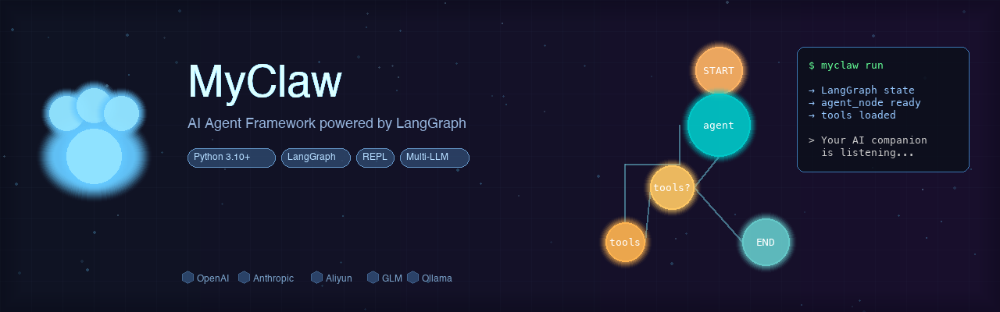
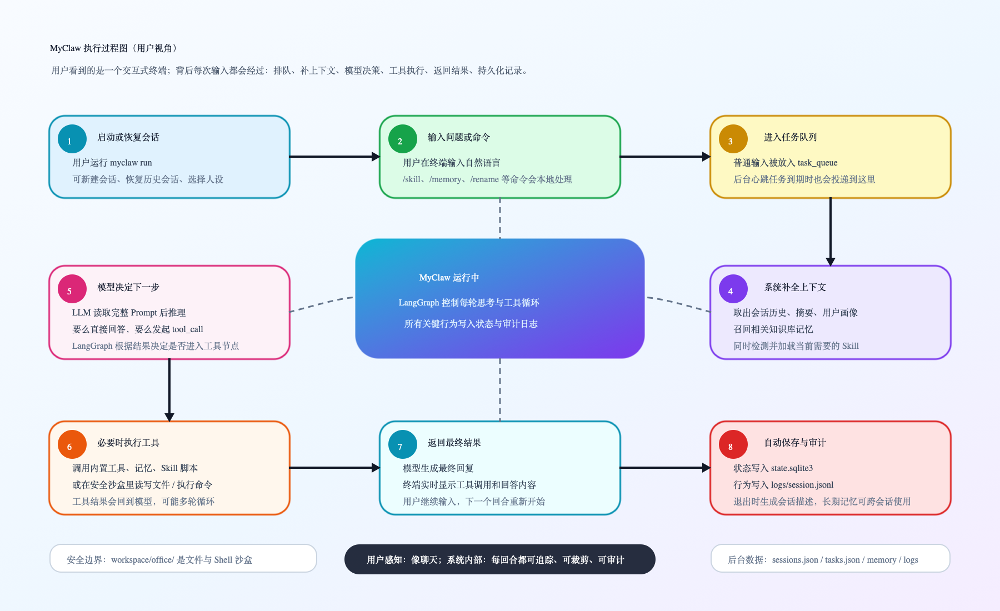
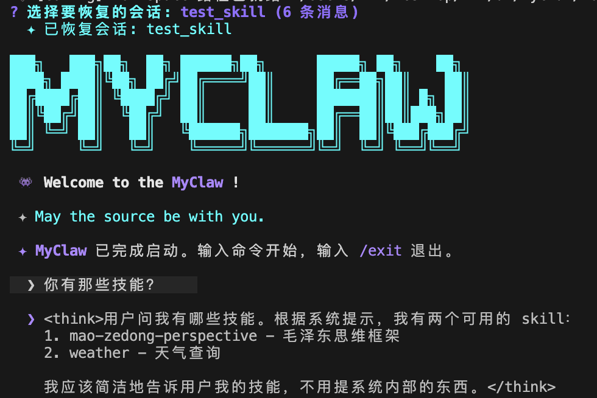

<div align="center">



# MyClaw

### 基于 LangGraph 的透明可控智能体框架

**Transparent & Controllable Agent Architecture** · Built with LangGraph

[快速开始](#快速开始) · [核心模块](#核心模块) · [安全沙盒](#安全沙盒)

</div>

---

> **让你的 AI 行为透明可控**
>
> 完整审计日志 + 安全沙盒 + 对话归档 + 多会话管理

---


## 简介

MyClaw 是一个基于 LangGraph 状态机的 AI Agent 框架，提供 REPL 交互式智能终端体验。

### 执行过程



### 核心特性

- **状态机驱动** - LangGraph 构建决策循环，每步可追溯
- **多模型适配** - 支持 OpenAI、Anthropic、阿里云、Z.AI、腾讯、Ollama 等
- **安全沙盒** - AST 白名单计算器 + 符号链接防御 + 环境隔离 + 命令黑名单
- **上下文裁剪** - 超过阈值自动压缩，归档完整历史到 JSONL
- **多会话管理** - 独立会话 ID、命名、描述、消息计数
- **多人设模板** - default/professional/friendly/custom 四种人设
- **动态技能** - 三段式加载 + slash command + TRIGGER 自动检测 + 工作流型 skill
- **知识库记忆** - 三层记忆体系（画像 + 摘要 + 知识库），被动召回 + 主动管理，跨会话保持事实一致
- **语义检索** - Embedding 向量嵌入 + 关键词混合评分，支持 Ollama/阿里云/OpenAI，不配置则降级为纯关键词
- **心跳任务** - 后台定时任务引擎，支持 hourly/daily/weekly 循环
- **审计日志** - 6 类事件 JSONL 记录，支持实时监控

---

## 核心模块

### 模块结构

```
myclaw/core/
├── agent.py              # LangGraph 状态机（核心决策引擎）
├── context.py            # AgentState 状态定义 + 上下文裁剪
├── provider.py           # 多模型适配工厂
├── embedding_provider.py # Embedding 提供商工厂（Ollama/阿里云/OpenAI）
├── embedding_store.py    # 向量存储管理（sqlite-vec + 增量嵌入 + 语义检索）
├── session.py            # 会话元数据管理器（单例）
├── bus.py                # asyncio.Queue 任务队列
├── heartbeat.py          # 心跳任务引擎
├── logger.py             # 异步 JSONL 日志 + 消息归档
├── skill_loader.py       # 三段式技能加载 + TRIGGER 自动检测
├── prompt_loader.py      # 人设模板加载器
├── config.py             # 运行时路径配置
├── prompts/              # 人设模板目录
│   ├── default.md        # 默认人设
│   ├── professional.md
│   ├── friendly.md
│   └── custom.md
└── tools/
    ├── base.py           # @my_tool 装饰器 + thread_id 管理
    ├── builtins.py       # 内置工具集（20 个，含知识库工具 + 混合评分）
    └── sandbox_tools.py  # 沙盒安全工具
```

### LangGraph 状态机流转

```
START → agent_node → tools_condition
                           ↓ 有 tool_call → tools → agent_node
                           ↓ 无 tool_call → END
```

**agent_node 核心逻辑**：

1. 记录工具执行结果到日志
2. 上下文裁剪（超过 40 轮触发）
3. 归档被裁剪消息到 JSONL
4. LLM 生成融合摘要
5. 注入用户画像 + Skill 索引 + 摘要
6. 调用 LLM 决策
7. 记录 tool_call / ai_message 到日志

---

## 安全沙盒

### sandbox_tools.py 安全防御

| 防御措施 | 实现方式 | 说明 |
|----------|----------|------|
| AST 白名单计算器 | `ast.parse` + `_SAFE_OPERATORS` 映射 | 替换 `eval()`，只允许数字和数学运算符 |
| 符号链接防御 | `os.path.realpath()` 解析真实路径 | 防止 `ln -s` 绕过沙盒边界 |
| 环境变量隔离 | `_SAFE_ENV_WHITELIST` 白名单 | 子进程只能访问 PATH/HOME/LANG，API Key 不可见 |
| 危险命令黑名单 | 41 个命令拦截 | curl/wget/python/ssh/sudo/kill 等 |
| 路径越权拦截 | `_DANGEROUS_PATH_PATTERNS` 正则 | ../、/、~、\、盘符全部拦截 |
| 超时熔断 | `subprocess.run(timeout=60)` | 命令执行 60 秒后强制终止 |
| 输出截断 | 2000 字符截断 | 防止 Token 爆炸 |


---

## 内置工具

| 工具 | 功能 | 安全级别 |
|------|------|----------|
| `get_current_time` | 获取系统时间 | 安全 |
| `calculator` | 数学计算 | AST 白名单 |
| `schedule_task` | 创建定时任务 | 安全 |
| `list_scheduled_tasks` | 查看任务列表 | 安全 |
| `delete_scheduled_task` | 删除任务 | 需确认 |
| `modify_scheduled_task` | 修改任务 | 需确认 |
| `save_user_profile` | 更新用户画像 | 安全 |
| `save_memory_note` | 写入知识库记忆 | 安全 |
| `list_memory_notes` | 列出知识库记忆 | 安全 |
| `read_memory_note` | 读取知识库记忆 | 安全 |
| `search_memory_notes` | 搜索知识库记忆 | 安全 |
| `update_memory_note` | 更新知识库记忆 | 安全 |
| `delete_memory_note` | 删除知识库记忆 | 安全 |
| `get_system_model_info` | 获取模型信息 | 安全 |
| `load_skill` | 加载技能内容 | 安全 |
| `execute_skill_script` | 执行 skill 脚本 | skill 目录内执行 |
| `list_office_files` | 列出沙盒文件 | 符号链接防御 |
| `read_office_file` | 读取沙盒文件 | 符号链接防御 |
| `write_office_file` | 写入沙盒文件 | 符号链接防御 |
| `execute_office_shell` | 执行 Shell | 环境隔离 + 黑名单 |

---

## 快速开始

### 安装

```bash
git clone https://github.com/your-repo/MyClaw.git
cd MyClaw

# 使用 uv（推荐）
uv sync

# 或 pip
pip install -e .
```

### 配置

```bash
myclaw config
```

交互式配置向导：
1. 选择提供商（OpenAI / Anthropic / 阿里云 / Z.AI / Ollama 等）
2. 输入 API Key
3. 配置 Base URL（可选）
4. 自动测试连接

### 运行

```bash
# 创建新会话（默认人设）
myclaw run

# 专业人设
myclaw run -p professional

# 友好人设
myclaw run -p friendly

# 查看历史会话
myclaw run -l

# 恢复指定会话
myclaw run -r "会话名称"

# 命名新会话
myclaw run -n "工作助手"
```

**运行效果示例：**



---

## 会话管理

### 会话数据存储

| 文件 | 说明 |
|------|------|
| `workspace/sessions.json` | 会话元数据（名称、描述、消息计数） |
| `workspace/state.sqlite3` | LangGraph 状态持久化（最近 10 轮 + 摘要） |
| `workspace/memory/knowledge/` | 知识库记忆（frontmatter + Markdown + 向量索引） |
| `logs/{session_id}.jsonl` | 审计日志 + 对话归档 |
| `workspace/tasks.json` | 定时任务（按 session_id 分离） |

### 会话命令

| 命令 | 说明 |
|------|------|
| `/skills` | 列出所有可用 skill |
| `/skill <name>` | 手动激活指定 skill |
| `/skill` | 显示当前激活的 skill 状态 |
| `/skill off` | 关闭当前激活的 skill |
| `/memory` | 显示知识库帮助 |
| `/memory list` | 列出知识库记忆 |
| `/memory read <id>` | 查看指定记忆 |
| `/memory forget <id>` | 删除指定记忆 |
| `/rename 新名字` | 重命名当前会话 |
| `/exit` | 退出并生成会话描述 |

---

## 上下文裁剪机制

### 裁剪逻辑

```
对话超过 40 覃
    ↓
归档旧消息到 JSONL（完整保存）
    ↓
LLM 生成融合摘要（旧摘要 + 旧对话）
    ↓
从 SQLite 删除旧消息
    ↓
保留最近 10 覃 + 摘要
```

### 覃完整性保证

每个用户回合以 HumanMessage 开始，包含后续 AIMessage、ToolMessage，整体保留或丢弃。

---

## 记忆体系

MyClaw 采用三层记忆架构，详细文档见 [docs/intro/memory.md](docs/intro/memory.md)。

| 层级 | 存储 | 注入方式 | 职责 |
|------|------|---------|------|
| 长期画像 | `memory/user_profile.md` | 每轮全量 | 用户偏好、习惯 |
| 对话摘要 | `state.sqlite3` summary | 每轮全量 | 近期对话进展 |
| 知识库 | `memory/knowledge/*.md` | 被动召回 Top 5 | 显式事实、项目知识 |

知识库支持**被动召回**（每轮基于用户输入自动检索相关记忆注入 prompt）和**主动操作**（Agent 调用 `save_memory_note` 等工具 / 用户使用 `/memory` 命令）。

### 语义检索（Embedding）

知识库检索采用**混合评分**策略，结合 Embedding 语义相似度与关键词匹配：

```
final_score = alpha × semantic_score + (1 - alpha) × keyword_norm
```

- `alpha` 默认 0.6（语义优先，关键词保底），可通过 `EMBEDDING_ALPHA` 环境变量调整
- 未配置 Embedding 时自动降级为纯关键词匹配
- 写入/更新/删除记忆时自动增量嵌入（content_hash 变更时才调用 API）

**支持的 Embedding 提供商**：

| 提供商 | 默认模型 | 说明 |
|--------|----------|------|
| `ollama` | `nomic-embed-text` | 本地部署，免费，推荐 `bge-m3` 做中文 |
| `aliyun` | `text-embedding-v3` | 阿里云 DashScope，中文效果好 |
| `openai` | `text-embedding-3-small` | OpenAI 官方 |

**向量存储**：`workspace/memory/knowledge/vec_index.sqlite3`（sqlite-vec 持久化，零基础设施）

**配置示例**：

```bash
# Ollama 本地（推荐中文场景）
EMBEDDING_PROVIDER=ollama
EMBEDDING_MODEL=bge-m3
EMBEDDING_API_BASE=http://localhost:11434

# 阿里云
EMBEDDING_PROVIDER=aliyun
EMBEDDING_MODEL=text-embedding-v3
```

---

## 审计日志

### 6 类事件

| 事件 | 触发时机 | 记录内容 |
|------|----------|----------|
| `llm_input` | 发送给 LLM 前 | 消息数量 |
| `tool_call` | LLM 决定调用工具 | 工具名 + 参数 |
| `tool_result` | 工具执行完毕 | 结果摘要 |
| `ai_message` | LLM 直接回复 | 回复内容 |
| `system_action` | 系统操作 | 心跳任务等 |
| `message_archive` | 上下文裁剪时 | 完整消息归档 |

### 日志格式

JSONL（每行一个 JSON），支持 `tail -f` 实时监控。

---

## 多模型适配

### provider.py 支持的提供商

| 提供商 | 接口 |
|--------|------|
| OpenAI | 原生 OpenAI API |
| Anthropic | 原生 Anthropic API |
| 阿里云 | OpenAI 兼容 |
| Z.AI (GLM) | OpenAI 兼容 |
| 腾讯混元 | OpenAI 兼容 |
| Minimax | OpenAI 兼容 |
| Ollama | 本地部署 |
| 其他 | 自定义 Base URL |

---

## 动态技能系统

### 三段式加载

**阶段一：索引扫描**
- 扫描 `workspace/office/skills/` 目录
- 解析 SKILL.md frontmatter
- 提取 name、description、trigger_words、trigger_condition、workflow 等
- 注入 System Prompt 的【可用 Skill 索引】区域

**阶段二：内容加载**
- `/skill <name>` 手动激活 或 自动触发检测
- 加载完整 SKILL.md 内容
- 注入 System Prompt 的【Skill 上下文】区域

**阶段三：引用资源**
- 加载 skill 目录下的辅助文档（references 字段定义）
- 如 `GUIDE.md`、`EXAMPLES.md` 等
- 与 SKILL.md 内容合并注入

### 触发机制

**手动激活（Slash Command）**
```
/skill weather     → 激活 weather skill
/skills            → 列出所有可用 skill
/skill off         → 关闭当前 skill
```

**自动触发检测**
```yaml
# SKILL.md 定义触发条件
trigger_condition: "TRIGGER when: 用户输入包含 天气 或 多少度 或 下雨"
skip_condition: "SKIP: 用户输入只是 天气 两个字"
```

检测时机：每轮用户输入时自动检测，匹配则注入 skill 内容。

### SKILL.md 格式

```yaml
---
name: weather
description: 获取天气预报
trigger_words:
  exact: [天气]                  # 精确匹配（完整相等）
  fuzzy: [气温, 气象, 多少度]    # 模糊匹配（包含即可）
trigger_condition: "TRIGGER when: 用户输入包含 天气 或 多少度"  # 条件触发
skip_condition: "SKIP: 用户输入只是 天气"                       # 跳过条件
workflow: true                   # 是否为工作流型 skill
references:                      # 第三段引用资源
  - GUIDE.md
  - EXAMPLES.md
tools:                           # 关联工具
  - type: script
    name: weather_query.py
---

## 功能说明
获取全球城市天气预报...

## 使用方法
调用 execute_skill_script 工具执行脚本...
```

### 工作流型 Skill

当 `workflow: true` 时，skill 不仅注入知识，还可执行关联工具：

| 工具类型 | 说明 |
|----------|------|
| `script` | skill 目录下的脚本文件（如 `.py`、`.sh`） |
| `builtin` | 内置工具引用 |

示例调用：
```
用户: 北京天气咋样
→ 自动触发 weather skill
→ LLM 调用 execute_skill_script(skill_name="weather", script_name="weather_query.py", script_args="北京")
→ 返回天气数据
```

### Skill 在上下文的位置

System Prompt 结构（从上到下）：
```
人设模板
【用户长期画像】
【可用 Skill 索引】      ← 所有 skill 的摘要（始终存在）
【近期对话上下文】
【Skill 上下文】         ← 激活/触发 skill 的完整内容（仅触发时存在）
```

---

## 心跳任务引擎

### pacemaker_loop

```
每 10s 检查 tasks.json
    ↓
发现到期任务 → 放入 task_queue
    ↓
Agent 自动执行提醒或动作
    ↓
循环任务 → 更新下次触发时间
```

### 支持的循环模式

- `hourly` - 每小时
- `daily` - 每天
- `weekly` - 每周

---

## 人设模板系统

### prompt_loader.py

通过 YAML frontmatter 定义人设元数据：

```markdown
---
name: professional
description: 精准严谨的技术顾问
language: zh-CN
---
```

### 占位符替换

- `{{SKILL_INDEX}}` → Skill 索引文本
- `{{USER_PROFILE}}` → 用户画像
- `{{CONTEXT_SUMMARY}}` → 近期对话摘要
- `{{KNOWLEDGE_CONTEXT}}` → 知识库召回内容

---

## 项目结构

```
MyClaw/
├── myclaw/core/           # 核心模块
├── entry/
│   ├── cli.py             # Typer CLI 入口
│   ├── main.py            # REPL 主程序
│   └── monitor.py         # 监控终端
├── workspace/
│   ├── office/            # 安全沙盒
│   │   └── skills/        # 技能卡槽
│   ├── memory/            # 用户画像 + 知识库
│   │   └── knowledge/    # 知识库记忆（index.json + *.md + vec_index.sqlite3）
│   ├── sessions.json      # 会话元数据
│   ├── state.sqlite3      # LangGraph 状态
│   └── tasks.json         # 定时任务
├── logs/                  # JSONL 日志
├── tests/                 # 测试套件
├── pyproject.toml
└── .env                   # 环境配置
```

---

## 环境配置

### .env 示例

```bash
DEFAULT_PROVIDER=aliyun
DEFAULT_MODEL=glm-5

OPENAI_API_KEY=sk-xxx      # OpenAI 兼容接口
ANTHROPIC_API_KEY=sk-xxx   # Anthropic 原生
```

---

## 开发指南

### 添加新工具

在 `myclaw/core/tools/builtins.py` 中：

```python
from .base import my_tool

@my_tool
def my_tool(arg: str) -> str:
    """工具描述"""
    return "结果"

BUILTIN_TOOLS.append(my_tool)
```

### 开发依赖

```bash
pip install -e ".[dev]"
pytest tests/
```

---

## 致谢

本项目基于 [CyberClaw](https://github.com/ttguy0707/CyberClaw) 二次开发，感谢原作者的开源贡献。

MyClaw 在原有基础上新增/优化了以下特性：

- **多人设模板系统** - default/professional/friendly/custom 四种人设，通过 `-p` 参数切换
- **会话管理机制** - 支持重命名、退出并生成描述、查看历史会话、恢复指定会话
- **skill 动态加载机制升级** - 三段式加载 + `/skill` slash command + TRIGGER/SKIP 自动检测 + 工作流型 skill（类似 Claude Code 技能系统）
- **符号链接防御** - `realpath()` 解析真实路径，防止 `ln -s` 绕过沙盒
- **环境变量隔离** - 白名单机制，API Key 等敏感信息不可被沙盒访问
- **危险命令黑名单扩展** - 从原有拦截扩展至 41 个危险命令
- **对话归档机制** - 被裁剪的旧消息完整保存到 JSONL，便于审计和恢复
- **知识库记忆系统** - 三层记忆体系（画像 + 摘要 + 知识库），被动召回 + 主动 CRUD，跨会话保持事实一致性
- **语义检索** - Embedding 向量嵌入 + 关键词混合评分（sqlite-vec），支持 Ollama/阿里云/OpenAI，不配置则降级为纯关键词
- **AST 白名单计算器** - 替换 `eval()`，彻底消除代码注入风险

---
## 许可证

MIT License

---

<div align="center">

**MyClaw · 透明可控智能体框架**

</div>